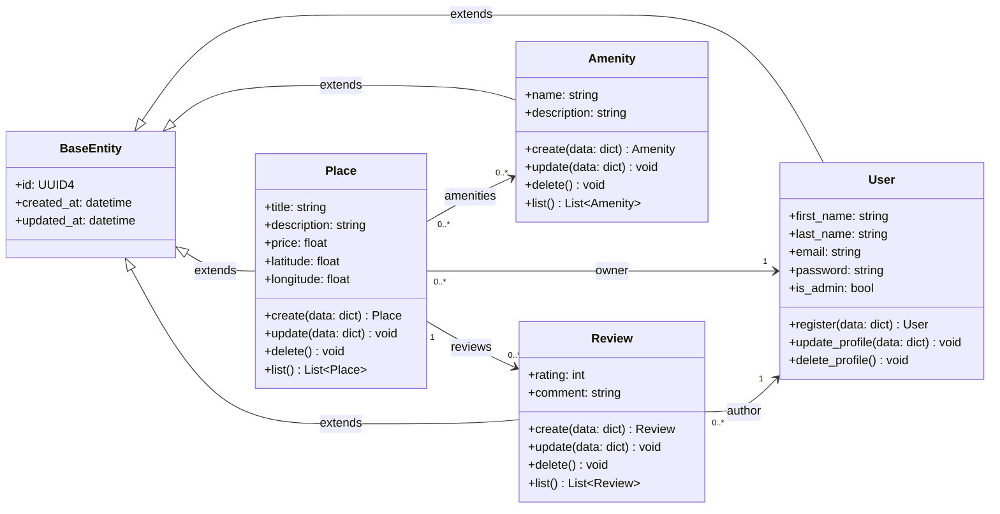

# Holberton School - HBnB
## Class Diagram for Business Logic Layer of the HBnB Evolution application

---

---

### **BaseEntity:** Common parent class for all HBnB entities.
- Provides shared attributes across all business entities.
- Includes:
  - A unique identifier in UUID4 format.
  - The datetime of instance creation.
  - The datetime of the last update.
- If no update has occurred, the update timestamp is identical to the creation timestamp.
- Ensures consistency and avoids duplication of common entity attributes.

---

### **User:** Represents a platform user who can own places and write reviews.
- Inherits common attributes from `BaseEntity`.
- Stores personal information and authentication data.
- Can register, update, or delete their profile.
- May have administrator privileges.
- Can own multiple places and write multiple reviews.

---

### **Place:** Represents a property listed by a user.
- Inherits common attributes from `BaseEntity`.
- Contains descriptive information, pricing, and geographic location.
- Each place is owned by exactly one user.
- A place can have multiple amenities and reviews.
- Supports creation, update, deletion, and listing operations.

---

### **Review:** Represents feedback left by a user for a place.
- Inherits common attributes from `BaseEntity`.
- Contains a rating and a comment.
- Each review is linked to one user (author) and one place.
- A place can have multiple reviews.
- Supports creation, update, deletion, and listing operations.

---

### **Amenity:** Represents a service or feature available in a place.
- Inherits common attributes from `BaseEntity`.
- Contains a name and description.
- Amenities can be shared across multiple places.
- Supports creation, update, deletion, and listing operations.

---

### **Entity Relationships:**
- **User–Place:** A user can own multiple places, while each place has exactly one owner.
- **Place–Review:** A place can have multiple reviews, but each review refers to a single place.
- **User–Review:** A user can write multiple reviews, but each review has only one author.
- **Place–Amenity:** Places can include multiple amenities, and amenities can be shared across multiple places.

These relationships define how core entities interact within the business logic layer and ensure consistent data connections across the application.
