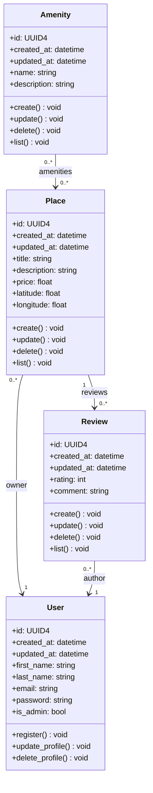

# Holberton School - HBnB
### Class Diagram for Business Logic Layer of the HBnB Evolution application

---

---

### **User:** Represents a platform user who can own places and write reviews.
- Stores personal information and authentication data.
- Can register, update, or delete their profile.
- May have administrator privileges.
- Can own multiple places and write multiple reviews.

### **Place:** Represents a property listed by a user.
- Contains descriptive information, pricing, and geographic location.
- Each place is owned by one user.
- A place can have multiple amenities and reviews.
- Supports creation, update, deletion, and listing operations.

### **Review:** Represents feedback left by a user for a place.
- Contains a rating and a comment.
- Each review is linked to one user (author) and one place.
- A place can have multiple reviews.
- Supports creation, update, deletion, and listing operations.

### **Amenity:** Represents a service or feature available in a place.
- Contains a name and description.
- Amenities can be shared across multiple places.
- Supports creation, update, deletion, and listing operations.

**Every instance of HBnB entities also includes:**
- A unique identifier in UUID4 format.
- The datetime of creation of the instance.
- The datetime of the last update of the instance. If no update has occurred, it is identical to the creation datetime.

---

### **Entity Relationships**
- **User–Place:** A user can own multiple places, while each place has exactly one owner.
- **Place–Review:** A place can have multiple reviews, but each review refers to a single place.
- **User–Review:** A user can write multiple reviews, but each review has only one author.
- **Place–Amenity:** Places can include multiple amenities, and amenities can be shared by multiple places.

These relationships define how core entities interact within the business logic layer and ensure consistent data connections across the application.
