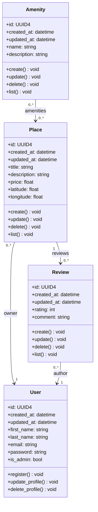

# Holberton School - HBnB
### Class Diagram for Business Logic Layer of the HBnB Evolution application

---

```mermaid
classDiagram

class User {
    +id: UUID4
    +created_at: datetime
    +updated_at: datetime

    +first_name: string
    +last_name: string
    +email: string
    +password: string
    +is_admin: bool

    +register() void
    +update_profile() void
    +delete_profile() void
}

class Place {
    +id: UUID4
    +created_at: datetime
    +updated_at: datetime

    +title: string
    +description: string
    +price: float
    +latitude: float
    +longitude: float

    +create() void
    +update() void
    +delete() void
    +list() void
}

class Review {
    +id: UUID4
    +created_at: datetime
    +updated_at: datetime
    +rating: int
    +comment: string

    +create() void
    +update() void
    +delete() void
    +list() void
}

class Amenity {
    +id: UUID4
    +created_at: datetime
    +updated_at: datetime
    +name: string
    +description: string

    +create() void
    +update() void
    +delete() void
    +list() void
}

Place "0..*" --> "1" User : owner
Amenity "0..*" --> "0..*" Place : amenities
Place "1" --> "0..*" Review : reviews
Review "0..*" --> "1" User : author
```

---
