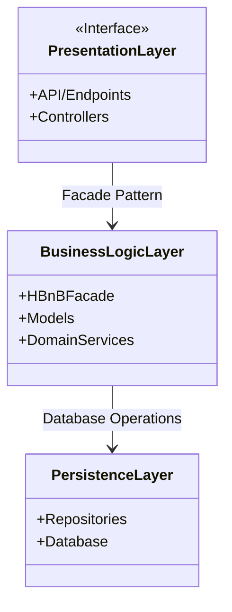
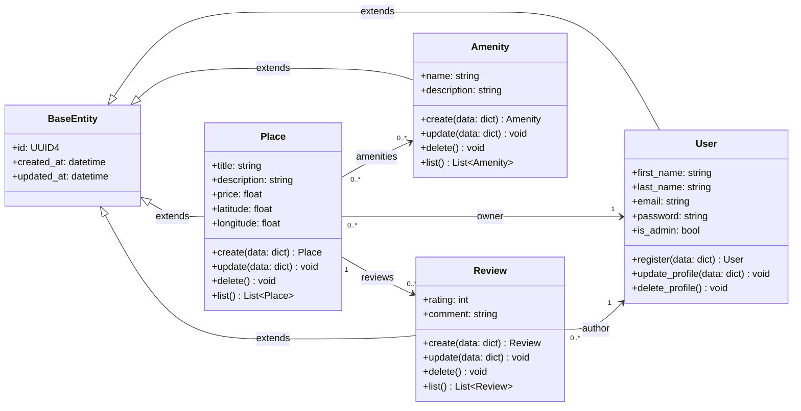
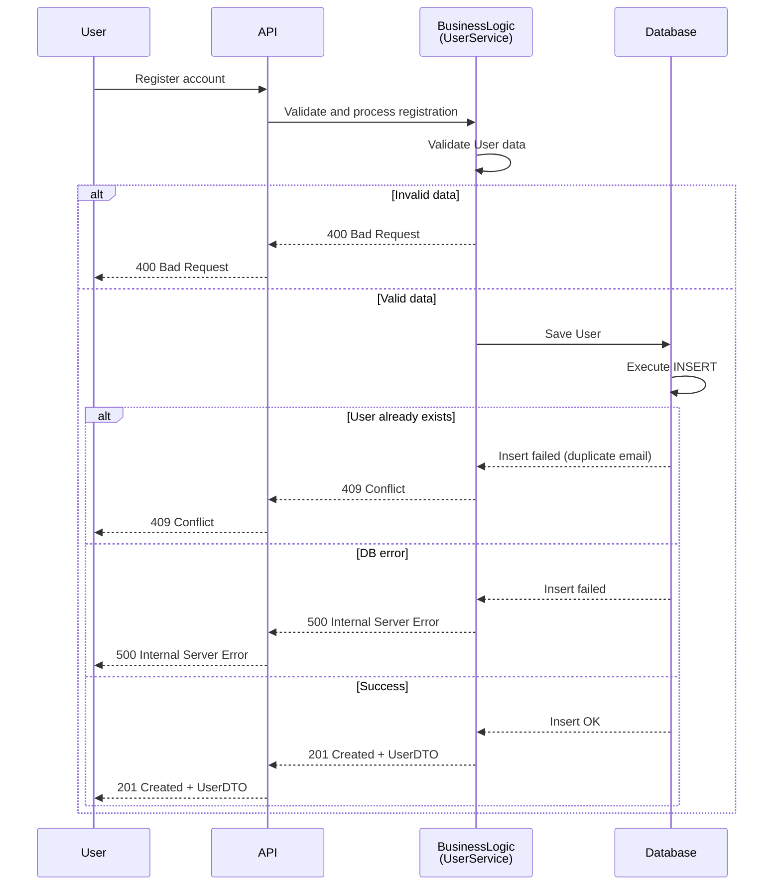
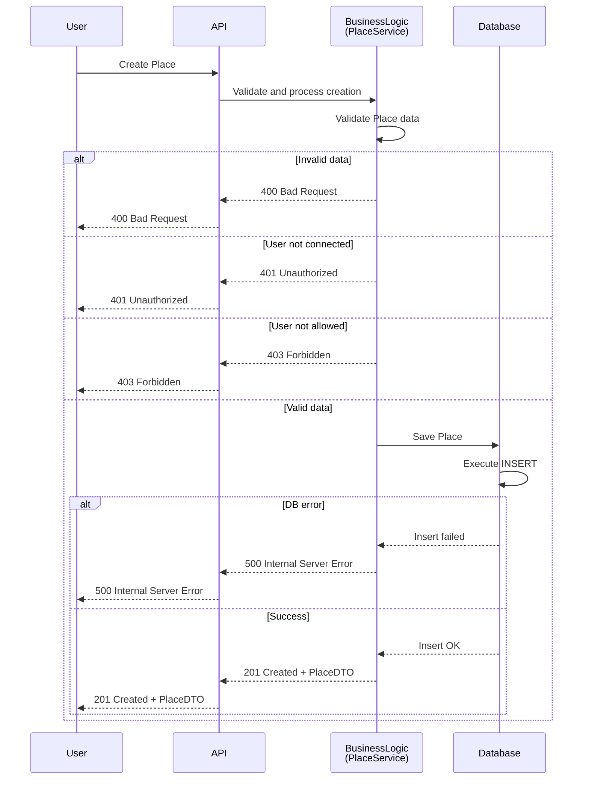
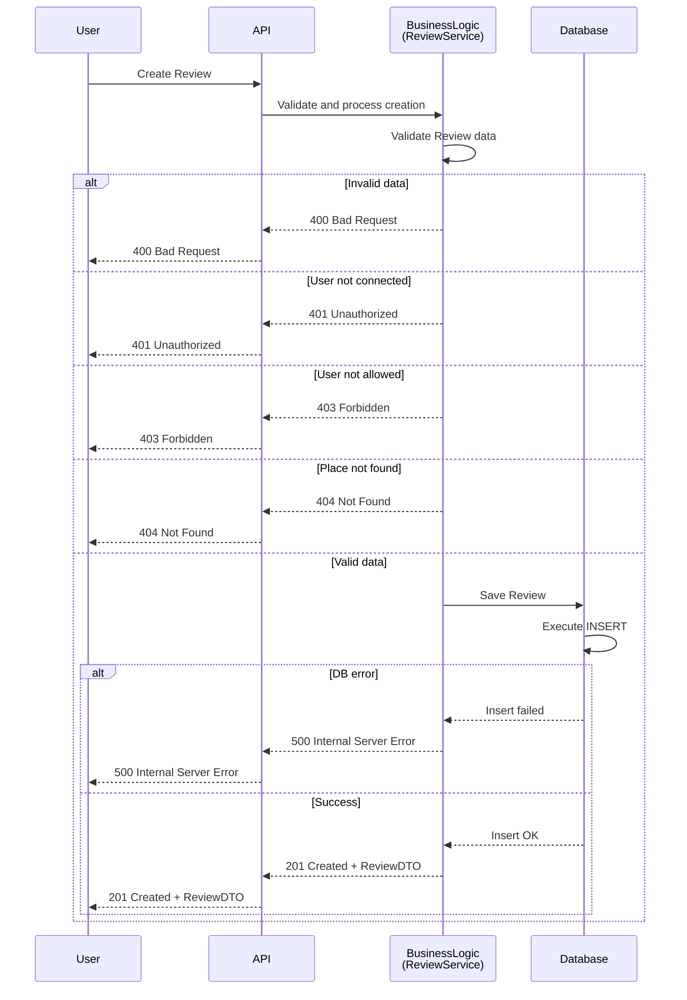
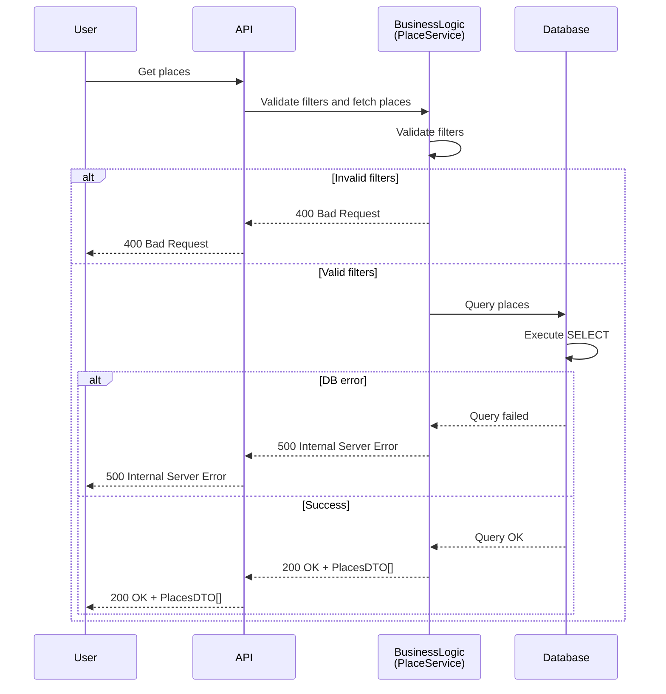

# Holberton School - HBnB 
## Technical Documentation of the HBnB Evolution application

---

## Introduction:
**HBnB Evolution is a simplified AirBnB-like platform designed to manage users, places, amenities, and reviews.**

This first phase of the HBnB project, the objective was to give a clear understanding of the application's architecture by creating visual diagrams, underlining the interactions within the system.
This document sums up all diagrams aud explanations into a simple technical document. 
The purpose of that document is to give a clear guideline in the elaboration of the HBnB architecture, detailling the different interactions between the layers and classes of the application. 

---

## High-Level Architecture:
**This diagram illustrates the main structure of the application, his three main layers, the components in each of them, and the communication between them.**

### High-Level Package Diagram of the HBnB Evolution application:

---

### Description of the layered architecture of the HBnB Evolution application:
The aim of the three layers of the diagram is to seperate responsabilities:
- API is the entry point where external clients send requests. Controllers receive requests and call business logic.
- Business Logic Layer is the brain of the application. It contains application rules and core logic. HBnBFacade is the single entry point to access business operations: it centralizes the operations and simplifizes the access to the business logic. Models are core entities representing application objects (see Class Diagram). DomainServices contain the business logic and the relation between entities (e.g.: check that the user is allowed to review a place).
- Persistence Layer handles data storage and retrieval. Repositories are intermediaries between business logic and data base. They manage saving, update and loading objects from database. Database is the real storage of the application data permanently.

---

## Business Logic Layer:
**This diagram shows the differents classes, attributes and methods and illustrate the intrications and relations between them.**

### Class diagram:

---

### Description of the Class Diagram refering to the business logic layer:

This diagram represents the internal structure of the business logic of HBnB. It is divided in five entities:
- The BaseEntity is the common parent class for all HBnB entities. It provides shared attributes across all business entities.
- The User represents a platform user, it stores personal information and authentication data, can register, update, or delete their profile. It may have administrator privileges.
- Place represents a property, it contains descriptive information, pricing, and geographic location, and supports creation, update, deletion, and listing operations.
- The Review reunites the comment and rating given by other users. It Supports creation, update, deletion, and listing operations.
- The Amenity class brings together all the equipments of a place and manages them. It contains a name and description and supports creation, update, deletion, and listing operations.

The aim of the diagram is to represent to relations between the different instance classes. These relationships define how core entities interact within the business logic layer and ensure consistent data connections across the application.
All of the entities inherit common attributes from the BaseEntity
Place -> User (owner): a place belongs to one owner, but an owner can possess several places
Place -> Amenity: a place can have several amenities, and an equipment can be associated to several places
Place -> Review: a place can have several reviews, and each review concerns only one place
Review -> User (Author): one user can write several reviews, and each reviews has an author.

---

##  Interaction between the layers and the flow of information for API calls:
**This section provide illustrations for the main API calls in HBnB.**

### Sequence diagrams:

---

## 1. User Registration:
This kind of diagram shows the normal flow of a program and also the errors management: where validations occur, how errors are treated, which response is delivered to the user.

---

## Description:
This sequence diagram illustrates the process of user registration, from the client request to database persistence and response delivery.

### Business Rules:
- User email must be unique.
- User data must be valid before persistence.
- Registration fails if the email already exists.

### Possible Outcomes:
- 201 Created: user successfully created.
- 400 Bad Request: invalid user data.
- 409 Conflict: email already exists.
- 500 Internal Server Error: database failure.

---

## 2. Place Creation:

---

## Description:
This diagram shows how a place is created and stored after validation and authorization checks.

### Business Rules:
- Only authenticated users can create places.
- Each place must have valid data.
- The creator becomes the owner of the place.

### Possible Outcomes:
- 201 Created: place successfully created.
- 400 Bad Request: invalid place data.
- 401 Unauthorized: user not authenticated.
- 403 Forbidden: user not allowed to create a place.
- 500 Internal Server Error: database failure.

---

## 3. Review Submission:

---

## Description:
This diagram illustrates the submission of a review for a place.

### Business Rules:
- Only authenticated users can submit reviews.
- A user cannot review their own place.
- A review must target an existing place.
- Review data must be valid before saving.

### Possible Outcomes:
- 201 Created: review successfully saved.
- 400 Bad Request: invalid review data.
- 401 Unauthorized: user not authenticated.
- 403 Forbidden: user not allowed to review this place.
- 404 Not Found: place does not exist.
- 500 Internal Server Error: database failure.

---

## 4. Fetching a List of Places:

---

## Description:
This diagram shows how a list of places is fetched based on search filters.

### Business Rules:
- Search filters must be valid.
- Results may be empty if no places match filters.

### Possible Outcomes:
- 200 OK: places (or an empty list) successfully returned.
- 400 Bad Request: invalid search filters.
- 500 Internal Server Error: database failure.
