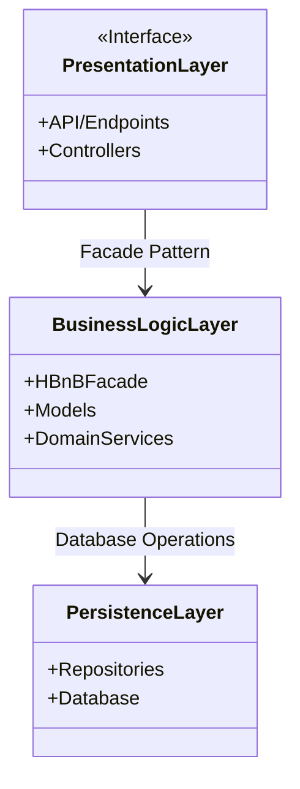

# Holberton School - HBnB
### High-Level Package Diagram of the HBnB Evolution application

---

---

### **Presentation Layer:** Handles user/API requests and returns responses.
- **API / Endpoints:** Entry points where external clients send requests.
- **Controllers:** Receive requests and call business logic (the Facade).

### **Business Logic Layer:** Contains application rules and core logic.
- **HBnBFacade:** Single entry point to access business operations.
- **Models:** Core entities representing application data.
- **DomainServices:** Implement business operations and rules.

### **Persistence Layer:** Handles data storage and retrieval.
- **Repositories:** Manage saving and loading objects from database.
- **Database:** Stores application data permanently.

---

### **Layer Interactions**
- **Presentation → Business Logic (Facade Pattern):**  
  The Presentation Layer communicates with the Business Logic Layer through the Facade, which provides a simplified interface to business operations.

- **Business Logic → Persistence (Database Operations):**  
  The Business Logic Layer accesses data storage through repositories, which handle communication with the database.

- **Separation of Responsibilities:**  
  Each layer has a specific role: presentation handles requests, business logic processes rules, and persistence manages data storage.

Responses follow the reverse path, returning processed data back to the client.
