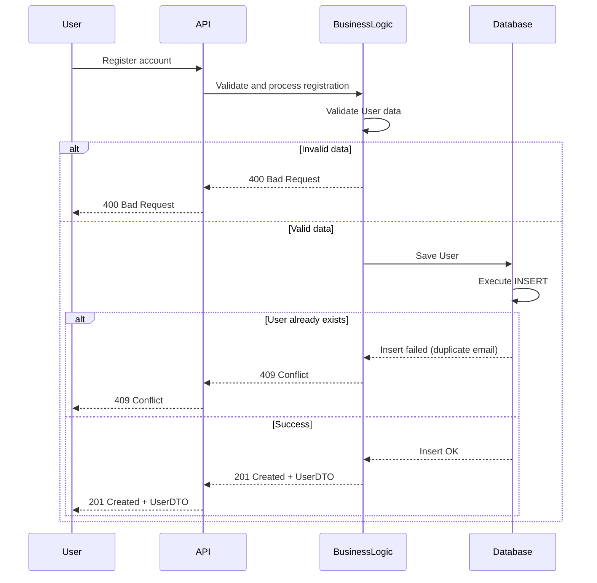
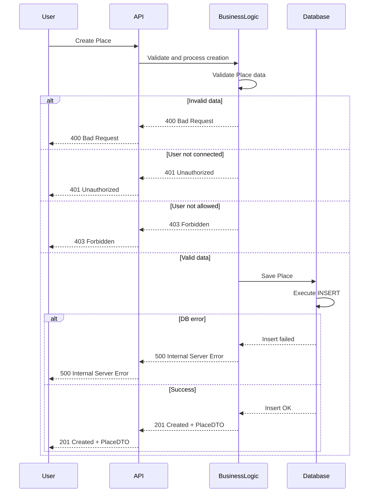
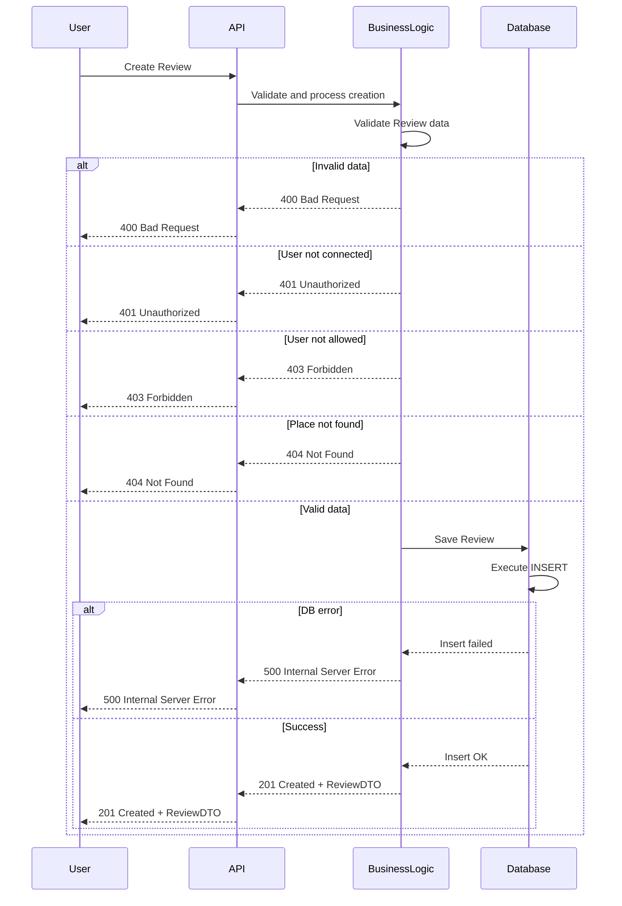
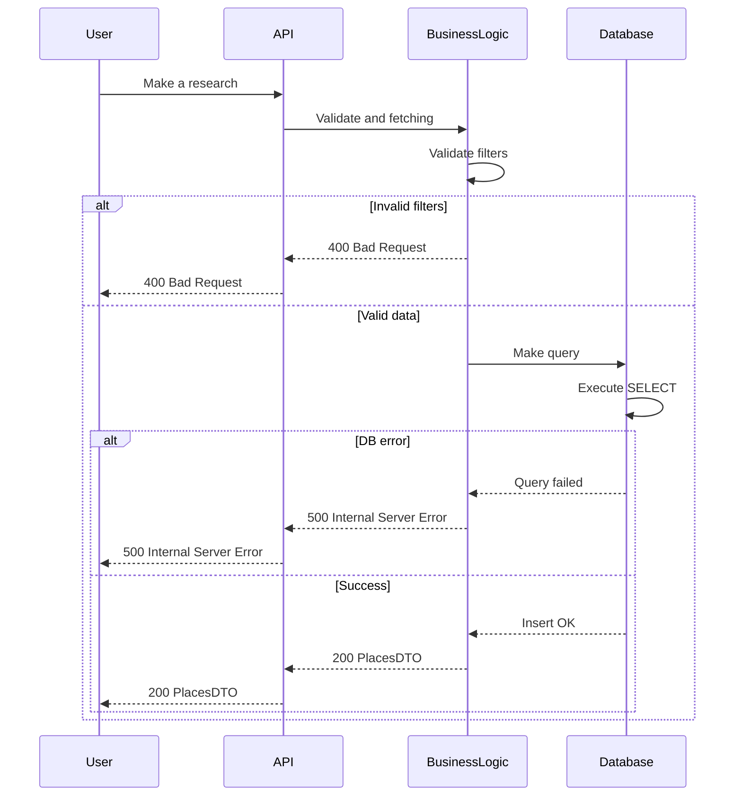

# Holberton School - HBnB
### Sequence Diagrams for API calls of the HBnB Evolution application

---

## 1. User Registration:

---

## 2. Place Creation:

---

## 3. Review Submission:

---

## 3. Fetching a List of Places:

