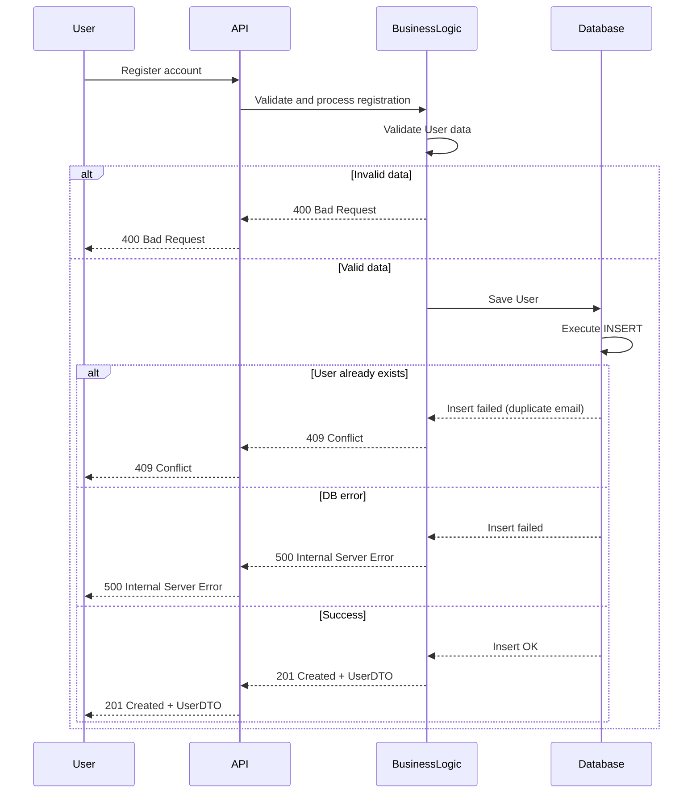
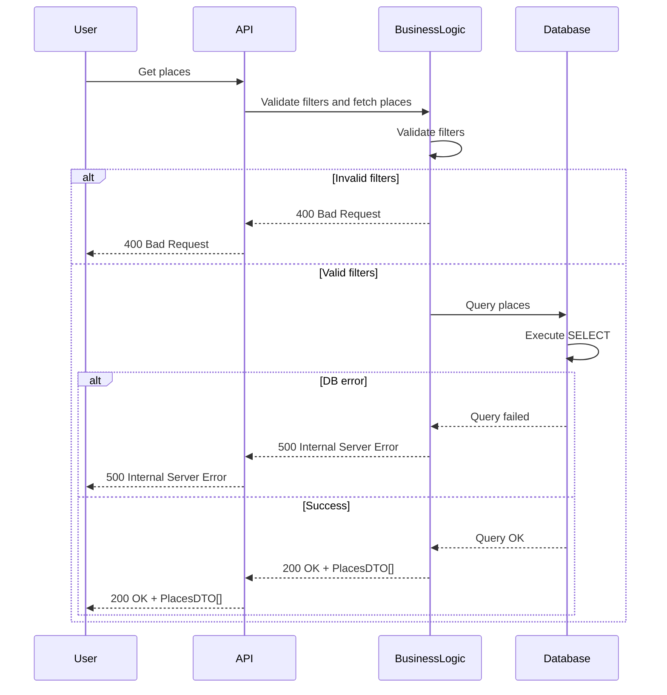

# Holberton School - HBnB
### Sequence Diagrams for API calls of the HBnB Evolution application

---

## 1. User Registration:

---

## Description
This sequence diagram illustrates the process of user registration, from the client request to database persistence and response delivery.

### Business Rules
- User email must be unique.
- User data must be valid before persistence.
- Registration fails if the email already exists.

### Possible Outcomes
- 201 Created: user successfully created.
- 400 Bad Request: invalid user data.
- 409 Conflict: email already exists.
- 500 Internal Server Error: database failure.

---

## 2. Place Creation:

---

## Description
This diagram shows how a place is created and stored after validation and authorization checks.

### Business Rules
- Only authenticated users can create places.
- Each place must have valid data.
- The creator becomes the owner of the place.

### Possible Outcomes
- 201 Created: place successfully created.
- 400 Bad Request: invalid place data.
- 401 Unauthorized: user not authenticated.
- 403 Forbidden: user not allowed to create a place.
- 500 Internal Server Error: database failure.

---

## 3. Review Submission:

---

## Description
This diagram illustrates the submission of a review for a place.

### Business Rules
- Only authenticated users can submit reviews.
- A user cannot review their own place.
- A review must target an existing place.
- Review data must be valid before saving.

### Possible Outcomes
- 201 Created: review successfully saved.
- 400 Bad Request: invalid review data.
- 401 Unauthorized: user not authenticated.
- 403 Forbidden: user not allowed to review this place.
- 404 Not Found: place does not exist.
- 500 Internal Server Error: database failure.

---

## 4. Fetching a List of Places:

---

## Description
This diagram shows how a list of places is fetched based on search filters.

### Business Rules
- Search filters must be valid.
- Results may be empty if no places match filters.

### Possible Outcomes
- 200 OK: places (or an empty list) successfully returned.
- 400 Bad Request: invalid search filters.
- 500 Internal Server Error: database failure.
